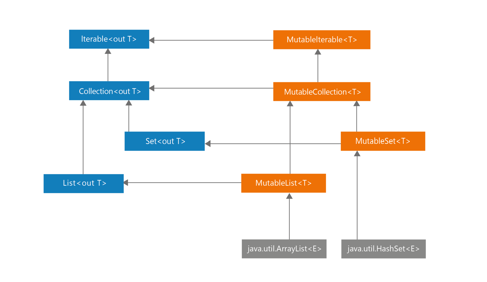
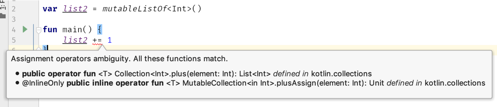

# Item 1: 限制可变性

在Kotlin中，我们使用模块（modules）设计程序，他们都由不同的元素组成，诸如类（classes）、对象（objects）、函数（functions）、类型别名（type
aliases）以及顶级属性（top-level properties）。有些元素可以持有状态值，例如持有可读写的属性`var`或者可变对象：

```kotlin
var a = 10
val list: MutableList<Int> = mutableListOf()
```

当元素持有状态时，他的行为不仅取决于你如何使用它，还有它被使用的历史。一个典型的例子，带有状态的类是一个有一些货币余额的银行账户：

```kotlin
class BankAccount {
    var balance = 0.0
        private set

    fun deposit(depositAmount: Double) {
        balance += depositAmount
    }

    @Throws(InsufficientFunds::class)
    fun withdraw(withdrawAmount: Double) {
        if (balance < withdrawAmount) {
            throw InsufficientFunds()
        }
        balance -= withdrawAmount
    }
}

class InsufficientFunds : Exception()
```

```kotlin
val account = BankAccount()
println(account.balance) // 0.0
account.deposit(100.0)
println(account.balance) // 100.0
account.withdraw(50.0)
println(account.balance) // 50.0
```

这里的`BankAccount`拥有一个代表当前账户中有多少余额的状态值。持有状态是一把双刃剑（double-edged
sword）。一方面他非常有用，因为它可以表示随时间变化的元素，但另一方面表示状态管理却很难，因为：

1. 大量的突变点会使程序更加难以理解和调试。这些突变点之间的关系需要被理解清楚，并且很多时候我们难以追踪它们是怎样改变的。拥有许多相互依赖的突变点的类往往更难理解或做出调整。在出现意外或者是抛出异常的时候尤其成问题。
2. 可变性使得对代码的推理变得更加困难。不可变元素的状态很清楚，可变状态却很难理解。很难推断状态当前的值是多少，因为它随时可能发生变化，我们仅仅某个时刻检查了并不意味着它一直是不变的。
3. 在多线程程序中进行适当地同步。每一个突变点都有潜在的冲突。
4. 可变元素更难测试。我们需要测试每一个可能的状态，可变性越大，需要测试的状态就越多。更重要的是，我们需要测试的状态数量通常会随着同一对象或文件中突变点的数量呈指数增长，因为我们需要测试所有可能状态的不同组合。
5. 当状态发生变化时，通常需要将此更改通知其他一些类。例如，当我们将一个可变元素添加到一个排序列表中时，一旦元素发生变化，我们就需要重新对这个列表进行排序。

对于在更大团队中工作的开发人员来说，状态一致性问题和具有更多突变点的项目的复杂性不断增加是很熟悉的。让我们看一个管理共享状态有多难的例子。看看下面的片段。它显示多个线程试图修改相同的属性，但是由于冲突，其中一些操作将会丢失。

```kotlin
var num = 0
for (i in 1..1000) {
    thread {
        Thread.sleep(10)
        num += 1
    }
}
Thread.sleep(5000)
print(num) // 不太可能是1000
// 每次都是不同的数字
```

当我们使用 Kotlin 协程时，冲突较少，因为涉及的线程较少，但它们仍然会发生：

```kotlin
suspend fun main() {
    var num = 0
    coroutineScope {
        for (i in 1..1000) {
            launch {
                delay(10)
                num += 1
            }
        }
    }
    print(num) // 每次都是不同的数字
}
```

在实际项目中，我们通常不能只丢失一些操作，因此我们需要像下面介绍的那样实现适当地同步。尽管实现正确地同步很困难，而且我们拥有的变异点越多，就越难。限制可变性确实有帮助。

```kotlin
val lock = Any()
var num = 0
for (i in 1..1000) {
    thread {
        Thread.sleep(10)
        synchronized(lock) {
            num += 1
        }
    }
}
Thread.sleep(1000)
print(num) // 1000
```

可变性的缺点如此之多，以至于有些语言根本不允许状态变化。这些是纯函数式语言。一个著名的例子是
Haskell。但是，此类语言很少用于主流开发，因为很难以如此有限的可变性进行编程。变异状态是表示现实世界系统状态的一种非常有用的方法。我建议使用可变性，但谨慎而明智地决定我们的变异点应该在哪里。好消息是
Kotlin 很好地支持限制可变性。

## 限制 Kotlin 中的可变性

Kotlin 旨在支持限制可变性。制作不可变对象或保持属性不可变很容易。它是这种语言的许多特性和特征的结果，但最重要的是：

- 只读属性`val`
- 可变集合和只读集合之间的分离
- `data class`的`copy`函数

让我们一一讨论。

### 只读属性`val`

在 Kotlin 中，我们可以将每个属性设为只读 val（value）或读写 var（variable）。只读属性 val 不允许再次赋值：

```kotlin
val a = 10
a = 20 // ERROR
```

请注意，只读属性不一定是不可变的或`final`的。只读属性可以包含可变对象:

```kotlin
val list = mutableListOf(1, 2, 3)
list.add(4)

println(list) // [1, 2, 3, 4]
```

也可以使用可能依赖于另一个属性的自定义 getter 来定义只读属性：

```kotlin
var name: String = "Marcin"
var surname: String = "Moskała"
val fullName
    get() = "$name $surname"

fun main() {
    println(fullName) // Marcin Moskała
    name = "Maja"
    println(fullName) // Maja Moskała
}
```

请注意，这是可能的，因为当我们定义自定义 getter 时， 每次我们询问值时都会调用它。

```kotlin
fun calculate(): Int {
    print("Calculating... ")
    return 42
}

val fizz = calculate() // Calculating...
val buzz
    get() = calculate()

fun main() {
    print(fizz) // 42
    print(fizz) // 42
    print(buzz) // Calculating... 42
    print(buzz) // Calculating... 42
}
```

默认情况下Kotlin 中的属性应该被封装，并且它们可以具有自定义访问器（getter 和 setter）。这一特性在 Kotlin 中非常重要，因为它在我们更改或定义
API 时为我们提供了灵活性。将在《Item16：属性应该表示状态，而不是行为》中详细描述，但核心思想是`val`不提供突变点，因为当`var`既是
getter 又是 setter 时，它只是底层的 getter。这就是为什么我们可以用`var`覆盖`val`：

```kotlin
interface Element {
    val active: Boolean
}

class ActualElement : Element {
    override var active: Boolean = false
}
```

只读属性`val`
的值可以更改，但此类属性不提供突变点，而突变点是我们需要同步或推理程序时出现问题的主要来源。这就是为什么我们通常更喜欢`val`
而不是`var`。尽管请记住`val`并不意味着不可变。它可以由 getter 或 delegate
定义。这个事实给了我们更多的改变自由。尽管当我们不需要它时，应该首选`final`属性。更容易对它们进行推理，因为它们在定义旁边说明了状态。它们在
Kotlin 中也得到了更好地支持。例如，它们可以被智能转换：

```kotlin
val name: String? = "Márton"
val surname: String = "Braun"

val fullName: String?
    get() = name?.let { "$it $surname" }

val fullName2: String? = name?.let { "$it $surname" }

fun main() {
    if (fullName != null) {
        println(fullName.length) // ERROR
    }

    if (fullName2 != null) {
        println(fullName2.length) // Márton Braun
    }
}
```

`fullName`不可能进行智能转换，因为它是使用 getter
定义的，因此它可能会在检查期间给出不同的值，而在稍后使用期间可能会给出不同的值（例如，如果其他线程将设置名称）。非本地属性只有在它们是最终的并且没有自定义
getter 时才能被智能转换。

### 可变集合和只读集合之间的分离

类似地，正如 Kotlin 分离读写和只读属性一样，Kotlin 分离读写和只读集合。这要归功于集合层次结构的设计方式。查看 Kotlin
中展示集合层次结构的图表。在左侧，您可以看到只读的 `Iterable`、`Collection`、`Set` 和 `List`
接口。这意味着他们没有任何允许修改的方法。在右侧，您可以看到表示可变集合的 `MutableIterable`、`MutableCollection`、`MutableSet`
和 `MutableList` 接口。请注意，每个可变接口都扩展了相应的只读接口，并添加了允许更改的方法。这类似于属性的工作方式。只读属性意味着只是一个
getter，而读写属性意味着既有 getter 又有 setter。

**Kotlin 中集合接口的层次结构和可在 Kotlin/JVM 上使用的实际对象。左侧界面是只读的。在右侧，集合和接口是可变的。**

只读集合不一定是不可变的。通常它们是可变的，但它们不能被改变，因为它们隐藏在只读接口后面。例如，`Iterable<T>.map`
和 `Iterable<T>.filter`函数返回`ArrayList`，这是一个可变列表，作为一个`List`
，这是一个只读接口。在下面的代码片段中，您可以看到来自`stdlib`的`Iterable<T>.map`的简化实现

```kotlin
inline fun <T, R> Iterable<T>.map(
    transformation: (T) -> R
): List<R> {
    val list = ArrayList<R>()
    for (elem in this) {
        list.add(transformation(elem))
    }
    return list
}
```

使这些集合接口成为只读而不是真正不可变的设计选择非常重要。它给了我们更多的自由。在幕后，只要满足接口，就可以返回任何实际集合。因此，我们可以使用特定于平台的集合。
这种方法的安全性接近于拥有不可变集合所实现的安全性。唯一的风险是当开发人员试图“破解系统”并执行向下转换时。这是 Kotlin
项目中永远不应该允许的事情。我们应该能够相信，当我们将列表返回为只读时，它将仅用于读取它。这是契约（contract）的一部分。
在本书的第 2 部分中有更多相关信息。

向下转换集合不仅违反了它们的契约并且依赖于实现而不是我们应该的抽象，而且它也是不安全的并且可能导致令人惊讶的后果。看看这段代码:

```kotlin
val list = listOf(1, 2, 3)

// DON’T DO THIS!
if (list is MutableList) {
    list.add(4)
}
```

此操作的结果是特定于平台的。在 JVM 上，`listOf` 返回实现 Java List 接口的 `Arrays.ArrayList` 实例。此 Java List
接口具有 `add` 或 `set` 等方法，因此它转换为 Kotlin MutableList 接口。但是，`Arrays.ArrayList` 没有实现其中一些操作。这就是为什么上面代码的结果如下：
> Exception in thread “main”
> java.lang.UnsupportedOperationException
> at java.util.AbstractList.add(AbstractList.java:148)
> at java.util.AbstractList.add(AbstractList.java:108)

尽管不能保证从现在起一年后它会如何表现。基础集合可能会改变。它们可能会被 Kotlin
中实现得真正不可变集合所取代，并且根本不实现 `MutableList`。没有什么是可以保证的。这就是为什么**在 Kotlin
中永远不应将只读集合向下转换为可变集合**。如果您需要从只读更改为可变，您应该使用 `List.toMutableList`
函数，它会创建一个副本，然后您可以修改该副本：

```kotlin
val list = listOf(1, 2, 3)

val mutableList = list.toMutableList()
mutableList.add(4)
```

这种方式不会违反任何契约，而且对我们来说也更安全，因为我们可以放心，当我们将某些内容公开为 `List` 时，它不会被外部修改

### `data class`的`copy`函数

喜欢不可变对象的原因有很多——不改变其内部状态的对象，如 String 或 Int。除了我们通常更喜欢较少可变性的已经命名的原因之外，不可变对象还有其自身的优势：

1. 它们更容易推理，因为它们的状态在创建后保持不变。
2. 不变性使得程序更容易并行化，因为共享对象之间没有冲突。
3. 对不可变对象的引用可以被缓存，因为它们不会改变。
4. 我们不需要对不可变对象进行防御性复制。当我们复制不可变对象时，我们不需要使它成为深拷贝。
5. 不可变对象是构建其他对象的完美材料。既可变又不可变。我们仍然可以决定可变性发生在哪里，并且更容易对不可变对象进行操作。
6. 我们可以添加它们来设置或使用它们作为映射中的键，以反对不应该以这种方式使用的可变对象。这是因为这两个集合在 Kotlin/JVM
   中都使用哈希表，当我们修改已经分类到哈希表的元素时，它的分类可能不再正确，我们将无法找到它。
   这个问题会在《Item41：尊重hashCode的契约》中详细描述。对集合进行排序时，我们会遇到类似的问题。

```kotlin
val names: SortedSet<FullName> = TreeSet()
val person = FullName("AAA", "AAA")
names.add(person)
names.add(FullName("Jordan", "Hansen"))
names.add(FullName("David", "Blanc"))

print(s) // [AAA AAA, David Blanc, Jordan Hansen]
print(person in names) // true

person.name = "ZZZ"
print(names) // [ZZZ AAA, David Blanc, Jordan Hansen]
print(person in names) // false
```

在最后一次检查时，集合返回 false，即使那个人在这个集合中。找不到，因为它的位置不正确。

如您所见，可变对象更危险且更难预测。另一方面，不可变对象最大的问题是数据有时需要改变。解决方案是不可变对象应该具有在某些更改后生成对象的方法。例如，`Int`
是不可变的，它有许多方法，如 `plus` 或 `minus` 不修改它，而是在该操作后返回一个新的 `Int`。`Iterable` 是只读的，像 `map`
或 `filter`
这样的集合处理函数不会修改它，而是返回一个新地集合。这同样适用于我们的不可变对象。例如，假设我们有一个不可变的类 `User`
，我们需要允许它的姓氏改变。我们可以使用 `withSurname` 方法来支持它，该方法生成一个特定属性已更改的副本

```kotlin
class User(
    val name: String,
    val surname: String
) {
    fun withSurname(surname: String) = User(name, surname)
}

var user = User("Maja", "Markiewicz")
user = user.withSurname("Moskała")
print(user) // User(name=Maja, surname=Moskała)
```

编写这样的函数是可能的，但如果我们需要为每个属性编写一个函数，也会很乏味。数据修改器来拯救了。它生成的方法之一是复制。它创建一个新实例，默认情况下所
有主构造函数属性都与前一个相同。也可以指定新值。copy 连同数据修饰符生成的其他方法在《Item
37：使用数据修饰符表示数据束》中有详细描述。这是一个简单的例子，展示了它是如何工作的：

```kotlin
data class User(
    val name: String,
    val surname: String
)

var user = User("Maja", "Markiewicz")
user = user.copy(surname = "Moskała")
print(user) // User(name=Maja, surname=Moskała)
```

这是一个优雅且通用的解决方案，支持使数据模型类不可变。当然，这种方式比只使用可变对象效率低，但它具有不可变对象的所有优点，默认情况下应该首选

## 不同种类的突变点

假设我们需要表示一个可变列表。我们可以通过两种方式实现这一目标。通过使用可变集合或通过使用读写属性`var`：

```kotlin
val list1: MutableList<Int> = mutableListOf()
var list2: List<Int> = listOf()
```

这两个属性都可以修改，但方式不同：

```kotlin
list1.add(1)
list2 = list2 + 1
```

这两种方式也可以用加号赋值运算符代替，但它们中的每一种都被转化为不同的行为：

```kotlin
list1 += 1 // 等价于 list1.plusAssign(1)
list2 += 1 // 等价于 list2 = list2.plus(1)
```

这两种方式都是正确的，各有利弊。它们都有一个突变点，但它位于不同的位置。在第一个中，具体列表实现发生了变化。我们可能会依赖于它在多线程情况下具有适当
地同步这一事实，但这种假设也很危险，因为它并不能真正得到保证。第二种，我们需要自己实现同步，但是整体安全性更好，因为变异点只是一个单一的属性。但是，
在缺乏同步的情况下，请记住我们仍然会丢失一些元素：

```kotlin
var list = listOf<Int>()
for (i in 1..1000) {
    thread {
        list = list + i
    }
}
Thread.sleep(1000)
print(list.size) // 不太可能是 1000,
// 每次都是不同的号码，例如 911
```

使用可变属性而不是可变列表允许我们在定义自定义设置器或使用委托（使用自定义设置器）时跟踪此属性如何变化。例如，当我们使用可观察的委托时，我们可以记录列表的每个更改：

```kotlin
var names by Delegates.observable(listOf<String>()) { _, old, new ->
    println("Names changed from $old to $new")
}

names += "Fabio"
// names 从 [] 变成 [Fabio]
names += "Bill"
// names 从 [Fabio] 变成 [Fabio, Bill]
```

为了使可变集合成为可能，我们需要集合的特殊可观察实现。对于可变属性的只读集合，控制它们如何变化也更容易——只有一个 setter
而不是多个方法来改变这个对象，我们可以将它设为私有：

```kotlin
var announcements = listOf<Announcement>()
    private set
```

简而言之，使用可变集合是一个稍快的选择，但使用可变属性可以让我们更好地控制对象的变化方式。

请注意，最糟糕地解决方案是同时拥有可变属性和可变集合：

```kotlin
// Don’t do that
var list3 = mutableListOf<Int>()
```

我们需要同步它可以变异的两种方式（通过属性更改和通过内部状态更改）。此外，由于含糊不清，无法使用 plus-assign 更改它：

一般规则是不应创建不必要的方法来改变状态。改变状态的每一种方式都是一种成本。它需要被理解和维护。我们更喜欢限制可变性。

## 不泄露突变点

当我们暴露构成状态的可变对象时，这是一种特别危险的情况。看看这个例子：

```kotlin
data class User(val name: String)

class UserRepository {
    private val storedUsers: MutableMap<Int, String> =
        mutableMapOf()

    fun loadAll(): MutableMap<Int, String> {
        return storedUsers
    }

    //...
}
```

可以使用 loadAll 修改 UserRepository 私有状态：

```kotlin
val userRepository = UserRepository()

val storedUsers = userRepository.loadAll()
storedUsers[4] = "Kirill"
//...

print(userRepository.loadAll()) // {4=Kirill}
```

当这种修改是偶然的时，尤其危险。我们有两种方法可以解决这个问题。第一个是复制返回的可变对象。我们称之为防御性复制。
当我们处理标准对象时，这可能是一种有用的技术，这里由数据修饰符生成的副本非常有用：

```kotlin
class UserHolder {
    private val user: MutableUser()

    fun get(): MutableUser {
        return user.copy()
    }

    //...
}
```

尽管只要有可能，我们更喜欢限制可变性，对于集合，我们可以通过将这些对象向上转换为它们的只读超类型来做到这一点：

```kotlin
data class User(val name: String)

class UserRepository {
    private val storedUsers: MutableMap<Int, String> =
        mutableMapOf()

    fun loadAll(): Map<Int, String> {
        return storedUsers
    }

    //...
}
```

## 总结

在本章中，我们了解了为什么限制可变性并优先使用不可变对象很重要。我们已经看到 Kotlin
为我们提供了许多支持限制可变性的工具。我们应该用它们来限制突变点。简单的规则是：

- 尽可能使用`val`而不是`var`。
- 尽可能使用不可变属性而不是可变属性。
- 如果您需要更改它们，请考虑使用不可变数据类，并使用 `copy`。
- 当你持有状态时，尽可能使用只读而不是可变集合。
- 明智地设计你的突变点，不要产生不必要的突变点。
- 不要公开可变对象。

这些规则有一些例外。有时我们更喜欢可变对象，因为它们更有效率。这种优化应该只在我们代码的性能关键部分（第 3 部分：效率）是首选，
并且当我们使用它们时，我们需要记住，在为多线程准备时需要更多关注可变性。底线是我们应该限制可变性。
