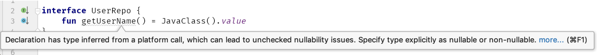

# Item3: 尽快消除平台类型

Kotlin引入的空安全机制是令人惊叹的。Java在社区中以空指针异常（NPE）而闻名，而Kotlin的安全机制使它们变得很少或完全消除。尽管有一件事是无法完全保证的，那就是一种没有坚实空安全机制的语言（如Java或C）与Kotlin之间的连接。想象一下，我们使用一个声明字符串为返回类型的Java方法。在Kotlin中应该是什么类型呢？

如果它带有@Nullable注释，则我们假定它是可空的，并将其解释为String?。如果它带有@NotNull注释，则我们信任此注释，并将其类型化为String。但是，如果这个返回类型没有用这些注释中的任何一个注释来标注呢？

```java
// Java
public class JavaTest {

   public String giveName() {
       // ...
   }
}
```
我们可以说，那么我们应该将这种类型视为可空的。这将是一种安全的方法，因为在 Java 中一切都是可空的。但是，我们通常知道某些东西不为空，因此我们最终会在我们的代码中使用非空断言 !!。真正的问题在于，当我们需要从 Java 中获取泛型类型时。想象一下，一个 Java API 返回一个没有任何注释的 List<User>。如果 Kotlin 默认假定可空类型，并且我们知道此列表和这些用户不为空，我们不仅需要断言整个列表，还需要过滤空值：

```java
// Java
public class UserRepo {
    
    public List<User> getUsers() {
        // ...
    }
}
```
```kotlin
// Kotlin
val users: List<User> = UserRepo().users!!.filterNotNull()
```

如果一个函数返回一个List<List<User>>会怎样呢？情况就会变得复杂：

```kotlin
// Kotlin
val users: List<List<User>> = UserRepo().groupedUsers!!.map{
    it!!.filterNotNull()
}
```


“至少List具有像map和filterNotNull这样的函数。在其他泛型类型中，空值性将是一个更大的问题。这就是为什么，与默认情况下被视为可空不同，来自Java并具有未知空值性的类型在Kotlin中是一种特殊类型。它被称为平台类型。

_平台类型——来自另一种语言并具有未知空值性的类型。_

平台类型的表示方法是在类型名称后面加上一个惊叹号!，比如String!。但是，这种表示法不能在代码中使用。平台类型是不可表示的，这意味着不能在语言中明确地写下它们。当平台值被赋给Kotlin变量或属性时，它可以被推断出来，但不能被明确地设置。相反，我们可以选择我们期望的类型：可空或非空类型。

```java
// Java
public class UserRepo {
    public User getUser() {
        // ...
    }
}
```

```kotlin
// Kotlin
val repo = UserRepo()
val user1 = repo.user // Type of user1 is User!
val user2: User = repo.user // Type of user2 is User
val user3: User? = repo.user // Type of user3 is User?
```

由于这个事实，从Java获取泛型类型并不成问题：

```kotlin
val users: List<User> = UserRepo().users
val users: List<List<User>> = UserRepo().groupedUsers
```

问题在于，仍然存在因为我们假定为非空而实际上为空的情况。出于安全考虑，我始终建议在从Java获取平台类型时要非常谨慎。请记住，即使一个函数现在不返回空值，也并不意味着它不会在将来更改。如果它的设计者没有通过注释或在“注释中描述它，他们可以在不更改任何契约的情况下引入这种行为。

如果你对需要与Kotlin交互的Java代码有些控制权，尽可能引入@Nullable和@NotNull注释。

```java
// Java
import org.jetbrains.annotations.NotNull;

public class UserRepo {
    public @NotNull User getUser() {
        // ...
    }
}
```

这是我们想要很好地支持Kotlin开发人员的最重要的步骤之一（对Java开发人员也很重要）。在Kotlin成为一流公民后，注释许多公开类型是引入Android API中最重要的变化之一。这使得Android API更加友好。

请注意，支持许多不同类型的注释，包括以下注释：

- Jetbrains(@Nullable and @NotNull from org.jetbrains.annotations)
- Android(@Nullable and @NotNull from androidx.annotation)
- JSR-305(@Nullable, @CheckForNull and @Nonnull from javax.annotation)
- JavaX(@Nullable, @CheckForNull and @Nonnull from javax.annotation)
- FindBugs(@Nullable, @CheckForNull, @PossiblyNull and @NonNull from javax.annotation)
- FindBugs(@Nullable, @CheckForNull, @PossiblyNull and @NonNull from edu.umd.cs.findbugs.annotations)
- ReactiveX(@Nullable and @NonNull from io.reactivex.annotations)
- Eclipse(@Nullable and @NonNull from org.eclipse.jdt.annotations)
- Lombok(@NonNull from lombok)

或者，您可以使用JSR 305的@ParametersAreNonnullByDefault注释在Java中指定默认情况下所有类型都应为NotNull。

我们在Kotlin代码中也可以做些事情。出于安全原因，我的建议是尽快消除这些平台类型。要理解原因，请考虑在此示例中statedType和platformType函数的行为差异：

```java
public class JavaClass {
    public String getValue() {
        return null;
    }
}
```
```kotlin
fun statedType() {
    val value: String = JavaClass().value
    // ...
    println(value.length)
}

fun platformType() {
    val value = JavaClass().value
    // ...
    println(value.length)
}
```

在这两种情况下，开发人员都假设getValue不会返回null，但他们错了。这导致两种情况下都出现了NPE，但错误发生的位置有所不同。

在statedType中，NPE将在我们从Java获取值的同一行抛出。这将非常明确地表明我们错误地假设了一个非null类型，而我们得到了null。我们只需要更改它并调整我们的代码以适应这个变化。

在platformType中，NPE将在我们将此值用作非空时抛出。可能是在某个更复杂的表达式的中间。作为平台类型的变量既可以被视为可空的，也可以被视为非空的。这样的变量可能被安全地使用几次，然后不安全地使用并抛出NPE。当我们使用这样的属性时，类型系统无法保护我们。这与Java中的情况类似，但在Koltin中，我们并不期望使用对象时可能会出现NPE。很可能早晚会有人不安全地使用它，然后我们最终会遇到运行时异常，其原因可能并不容易找到。

```java
public class JavaClass {
    public String getValue() {
        return null;
    }
}
```
```kotlin
fun platformType() {
    val value = JavaClass().value
    // ...
    println(value.length) // NPE
}

fun statedType() {
    val value: String = JavaClass().value // NPE
    // ...
    println(value.length)
}
```

更危险的是，平台类型可能会进一步传播。例如，我们可能将平台类型作为接口的一部分公开：

```kotlin
interface UserRepo {
    fun getUserName() = JavaClass().value
}
```

在这种情况下，方法推断类型是一个平台类型。这意味着任何人仍然可以决定它是否可为空。在定义站点上，有人可能选择将其视为可空的，在使用站点上则视为非空的：

```kotlin
class RepoImpl: UserRepo {
    override fun getUserName(): String? {
        return null
    }
}

fun main() {
    val repo: UserRepo = RepoImpl()
    val text: String = repo.getUserName() // NPE in runtime
    print("User name length is ${text.length}")
}
```

传播平台类型是灾难的前兆。它们是有问题的，出于安全原因，我们应该尽快消除它们。在这种情况下，IDEA IntelliJ 会通过警告来帮助我们：



## 总结

来自其他语言且具有未知空值的类型称为平台类型。由于它们是危险的，我们应该尽快消除它们，不要让它们传播。此外，最好使用注释指定类型，以指定在公开的 Java 构造函数、方法和字段上的可空性。这对使用这些元素的 Java 和 Kotlin 开发人员都是宝贵的信息。